# Rap Quiz)

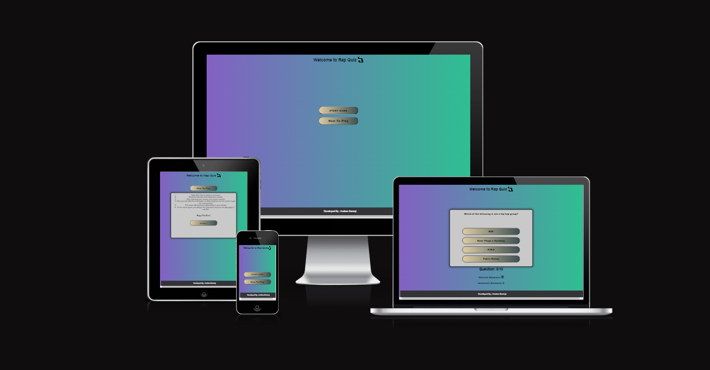

[Live Web Application Link](https://andreasarreqi.github.io/rap-quizz/)

## Introduction

Welcome to my very own [Rap Quiz](https://andreasarreqi.github.io/rap-quizz/). 

### How To Play
1. Click on the "How To Play" Button
2. After reading the rules/instructions click the "Ready" button.
3. After that you can click "Start Game" button.
4. You only get one chance to choose an answer so choose wisely.
5. Enjoy.

### Features

Favicon

Main Page

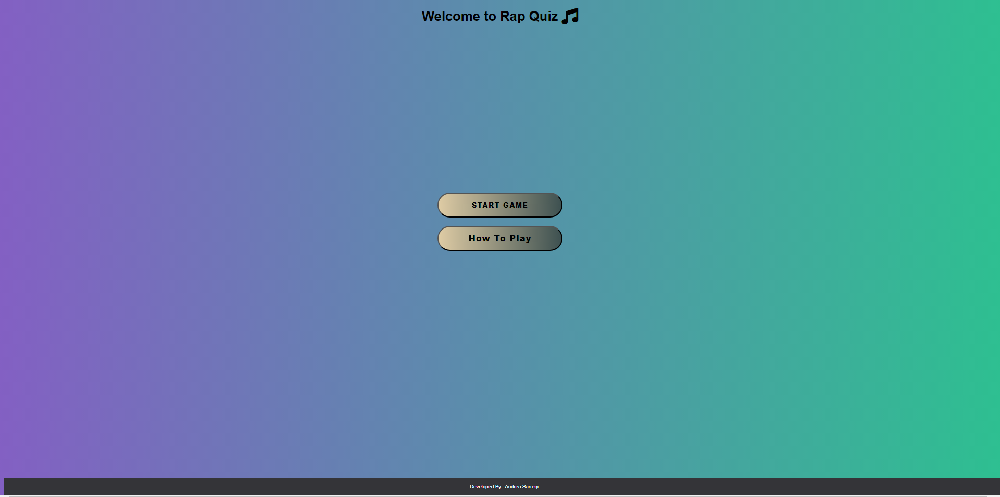

Start Button

How To Play Button

Rules

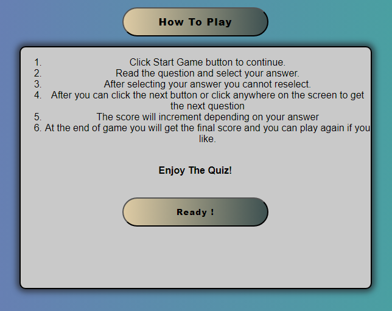

Quiz Area

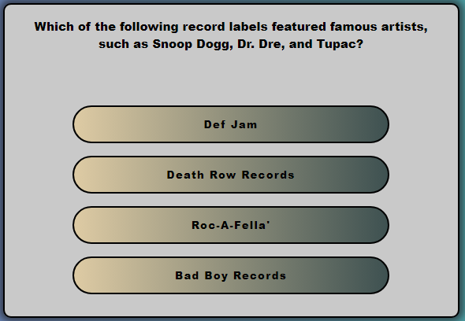

Correct Answer score & Modal

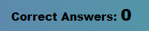

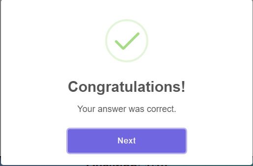

Incorrect Answer score & Modal

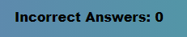

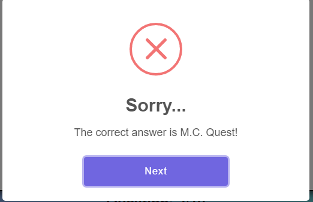

Game Over

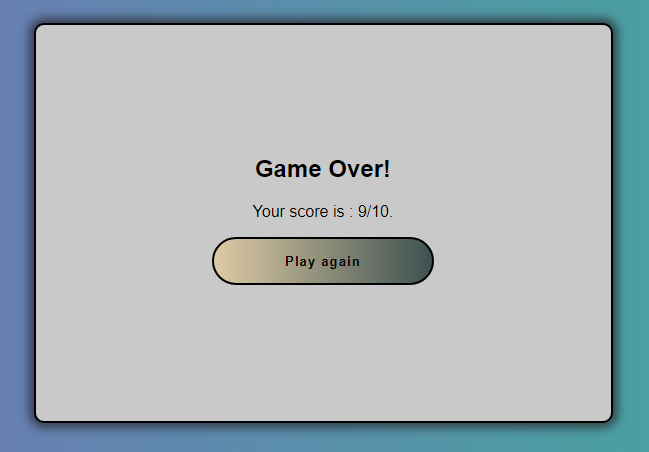

Play Again Button

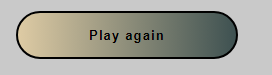

## Technologies used
- HTML 
- CSS
- JavaScript
- Git
- Github

### Future Features
- Add a user tab so the user can input a desired name.

##  Testing 

Rap Quiz - Manual Testing

## Functionality

<table>
  <tr>
   <td>
<strong>Test Label</strong>
</li>
</ol>
   </td>
   <td><strong>Test Action</strong>
   </td>
   <td colspan="2" ><strong>Expected Outcome</strong>
   </td>
   <td><strong>Test Outcome </strong>
   </td>
  </tr>
  <tr>
   <td>Site loading
   </td>
   <td>Navigate to the home
   </td>
   <td colspan="2" >Start and How to play Buttons.
   </td>
   <td>PASS
   </td>
  </tr>
  <tr>
   <td>Access homepage
   </td>
   <td>Instructions before playing the game.
   </td>
   <td colspan="2" >Rules on how to play the game
   </td>
   <td>PASS
   </td>
  </tr>
  <tr>
   <td>Answer question 1
   </td>
   <td>Correct Answer Feedback.
   </td>
   <td colspan="2" >Modal is displayed with the green Tick and congratulating the user and score automatically incremented.
   </td>
   <td>PASS
   </td>
  </tr>
  <tr>
   <td>Answer question 2
   </td>
   <td>Incorrect Answer Feedback.
   </td>
   <td colspan="2" >Modal is displayed with the red X and displaying the correct answer and automatic score incremented.
   </td>
   <td>PASS
   </td>
  </tr>
  <tr>
   <td>Question count
   </td>
   <td>Navigate to any question
   </td>
   <td colspan="2" >Current question number with total question is showed
   </td>
   <td>PASS
   </td>
  </tr>
  <tr>
   <td>Load next question
   </td>
   <td>Answer some question
   </td>
   <td colspan="2" >The next random question is loaded with the options shuffled each time.
   </td>
   <td>PASS
   </td>
  </tr>
  <tr>
   <td>End game
   </td>
   <td>Last Question Answered.
   </td>
   <td colspan="2" >The Game Over message is displayed with a total of the score.
   </td>
   <td>PASS
   </td>
  </tr>
  <tr>
   <td>Game Over.
   </td>
   <td>Game over Pop-up.
   </td>
   <td colspan="2" >Play again button is displayed
   </td>
  <tr>
   <td>Play again
   </td>
   <td>Choose to Play Again
   </td>
   <td colspan="2" >Quiz is reset including the score count.
   </td>
   <td>PASS
   </td>
  </tr>
</table>
<ol>

## Browser Compatibility

The website works on different browsers: <strong>Chrome, Firefox and Edge.</strong>

### Responsiveness

- Responsiveness was tested using: Chrome Dev Tools.

- Responsiveness was  tested using: [AM i Respnsive?](https://ui.dev/amiresponsive?url=https://andreasarreqi.github.io/rap-quizz/)

## User Stories 

All user stories were successfully performed.

1. As a player, I want to read through the rules/instructions quiz.
2. As a player, I want to answer the question with random ordered options.
3. As a player, I want to know if my answer is correct.
4. As a player, I want to know if my answer is incorrect.
5. As a player, I want to know how many questions the game has.
6. As a player, I want to know how many questions I answered in total.
7. As a player, I want to know how many questions I answered correcly.
8. As a player, I want to know how many questions I answered incorrectly.
9. As a player, I want to see my final score and know that the game has finished.
10. As a player, I want to be able to play again.

## Validator Testing 

HTML

HTML validator.

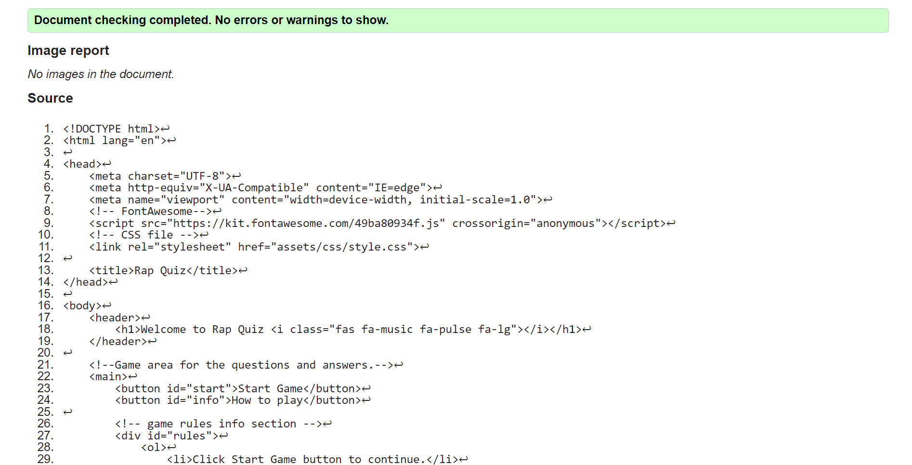

CSS

CSS validator.

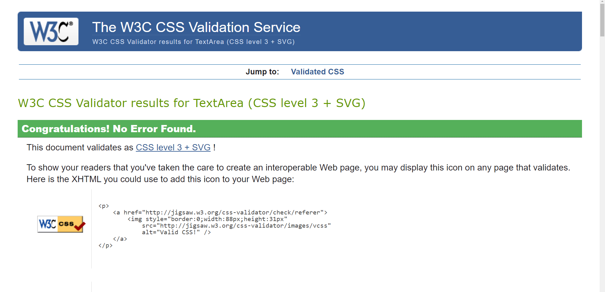

JavaScript

JS HINT  validator.

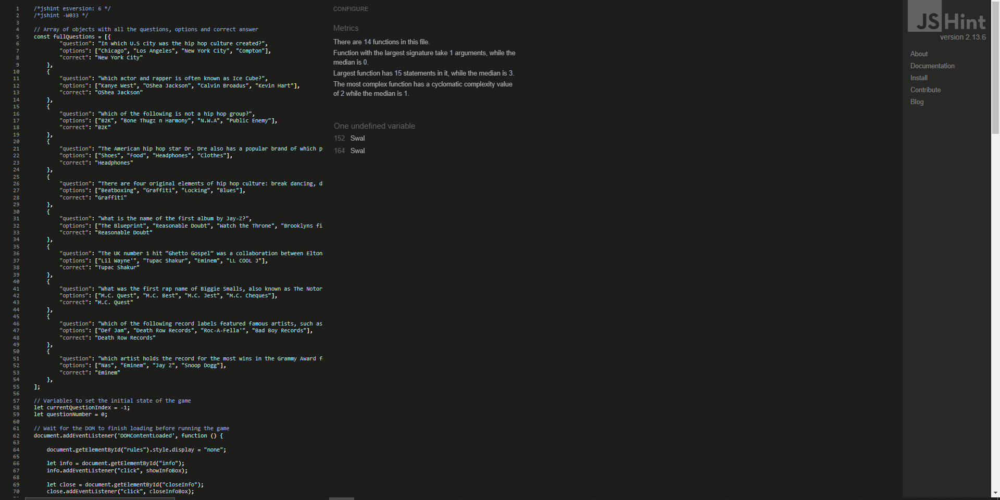

Lighthouse

Lighthouse.

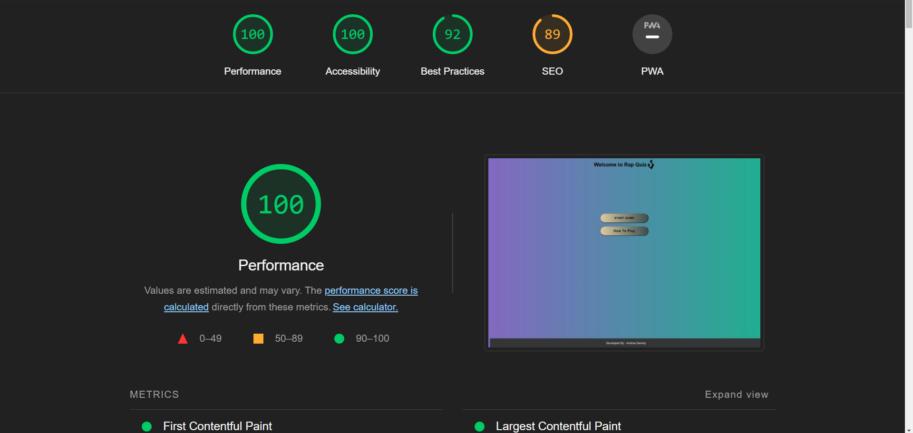

WAVE

WAVE validator.

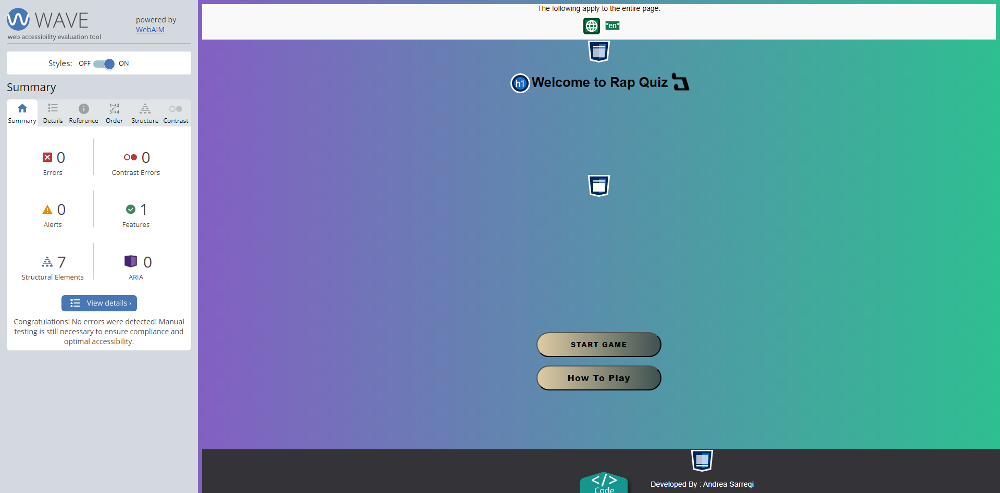

### Unfixed Bugs / Other

## Deployment

- The site was deployed to GitHub pages. The steps to deploy are as follows: 
  - In the GitHub repository, navigate to the Settings tab 
  - From the source section drop-down menu, select the Master Branch
  - Once the master branch has been selected, the page will be automatically refreshed with a detailed ribbon 
    display to indicate the successful deployment. 
  - The deployed app can be found [here](https://andreasarreqi.github.io/rap-quizz/)

## Credits 
- Font Awesome.

    

- Makeuseof.com (Linear gradient for background, buttons + Hover)

    

- SweetAlert 2 (Correct & Incorrect Modal)

    

    

## Acknowledgements
- I would like to thank my mentor Daisy for guiding me.

